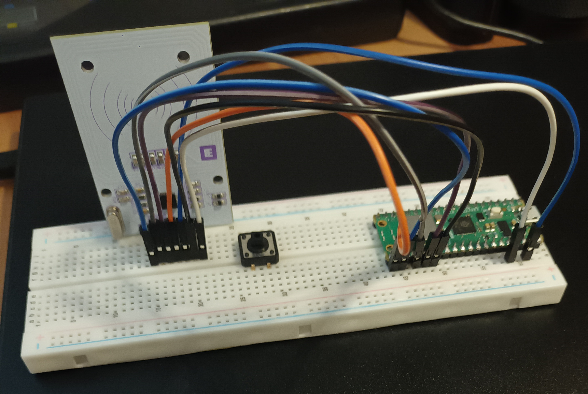

## MFRC522 Library for RP2040 (Raspberry PI W)

This specific implementation was made for the Whadda WPI405 MFRC522 breakout board.  
  
It has 8 ports. In order from left-to-right they are as following:  
IRQ, NSS, SCK, MOSI, MISO, GND, RST, VCC  

* NOTE: The IRQ pin is "optional" and I am not sure that it actually works, atleast I haven't made it work correctly yet.  

In my implementation I have connected the pins to the PI W using the following pins:  
| WPI405 Pin | PI W Pin | PI W Legend |
| :--------- | :------- | :---------- |
| NSS        | GP17     | SPI0, CSn   |
| SCK        | GP18     | SPI0, SCK   |
| MOSI       | GP19     | SPI0, TX    |
| MISO       | GP16     | SPI0, RX    |
| GND        | GND      | Ground      |
| RST        | GP20     | GPIO        |
| VCC        | Pin 36   | 3V3 Out     |
  
The src/test.c file contains a simple example for how to use the code.  
It does not *yet* contain any write to card implementation.  

### *test.c*: Expected output on successfull read from Mifare Classic 1K like tags
```c
ATQA      : 0400
UID       : FB 9B FF 72 
CRC: 60 16
SAK       : 08
Check Byte: ED
CRC: 8B B9
block 1: 00 00 00 00 00 00 00 00 00 00 00 00 00 00 00 00 
block 1 (str): 
```

### Pin Connection Example  

